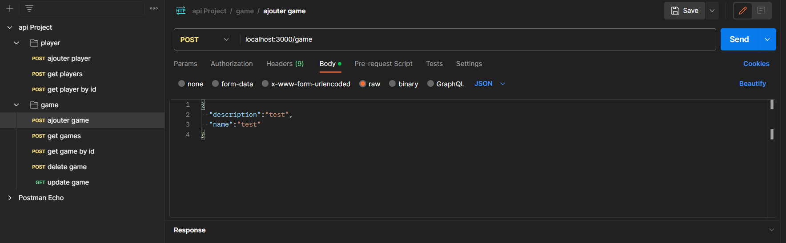
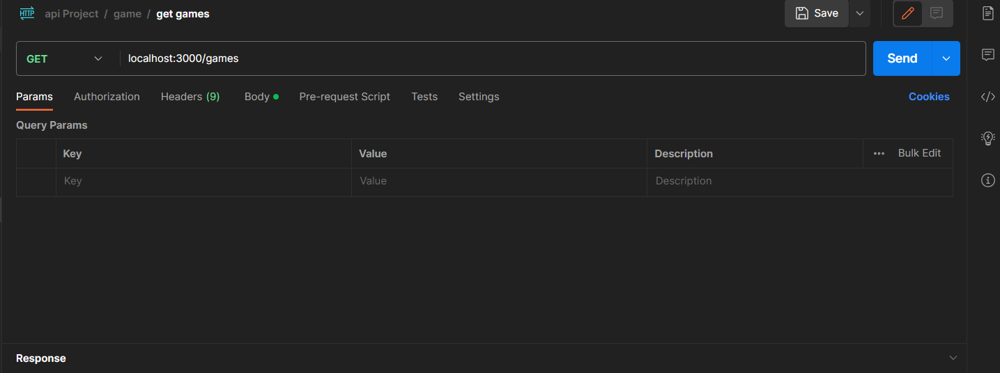
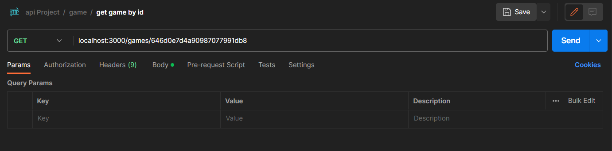
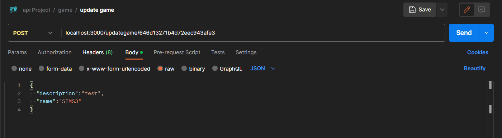
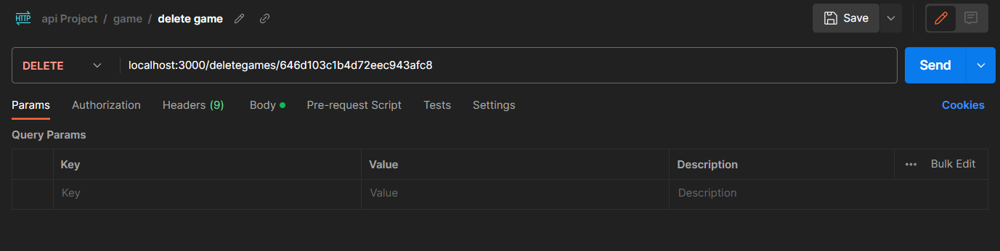
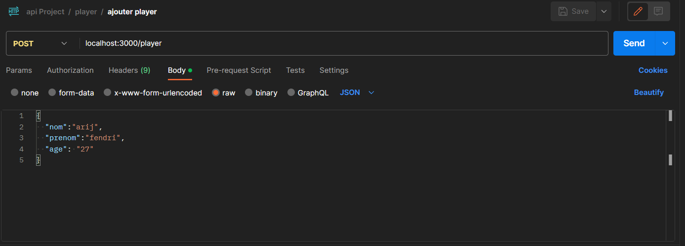
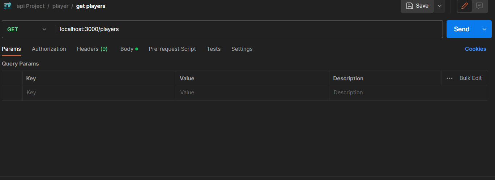
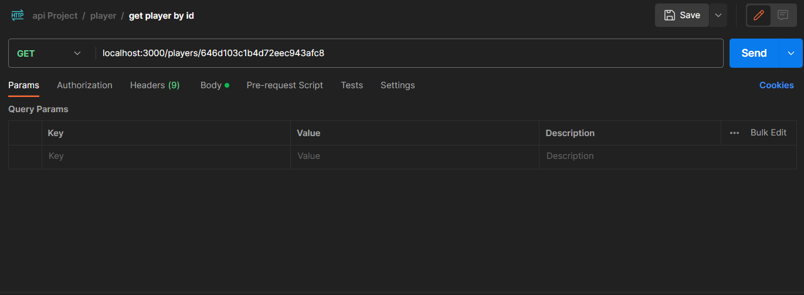

# Api Game&&Player Project
cette application consomme deux micro services
## start
- run game micro service `gameMicroservice`
```shell
node gameMicroservice.js
```
- run game micro service `playerMicroservice`
```shell
node playerMicroservice.js
```
- run game micro service `apiGateway`
```shell
node apiGateway.js
```
## technologies
 Express JS , GrapheQL , grpc , Rest , MongoDB 
### Game 
- Create Game

- get Games

- get Game by id  

- update Game 

- delete Game 

### player 
- Create Player

- get Players

- get Player by id  
